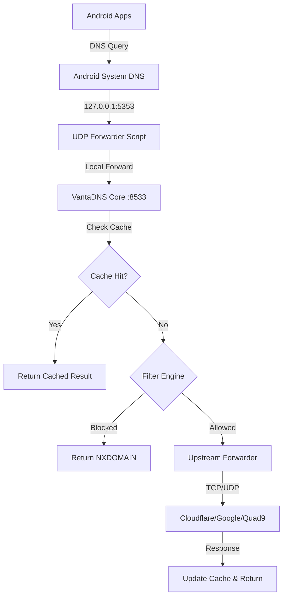

# VantaDNS

<div align="center">

```text
██╗   ██╗ █████╗ ██╗   ██╗███████╗██╗      ██████╗ ██████╗ ███████╗██████╗
██║   ██║██╔══██╗██║   ██║██╔════╝██║     ██╔═══██╗██╔══██╗██╔════╝██╔══██╗
██║   ██║███████║██║   ██║█████╗  ██║     ██║   ██║██████╔╝█████╗  ██████╔╝
╚██╗ ██╔╝██╔══██║██║   ██║██╔══╝  ██║     ██║   ██║██╔══██╗██╔══╝  ██╔══██╗
 ╚████╔╝ ██║  ██║╚██████╔╝██║     ███████╗╚██████╔╝██║  ██║███████╗██║  ██║
  ╚═══╝  ╚═╝  ╚═╝ ╚═════╝ ╚═╝     ╚══════╝ ╚═════╝ ╚═╝  ╚═╝╚══════╝╚═╝  ╚═╝
         DNS — High-performance, privacy-focused ad & tracker blocker
```

**A high-performance, privacy-focused custom Rust DNS filtering engine and caching resolver that blocks ads and trackers system-wide — runs directly on your Android phone via Termux, no root required.**

[](https://github.com/vincenzo-afk/VantaDNS/actions/workflows/rust.yml)
[](https://opensource.org/licenses/MIT)
[](https://github.com/vincenzo-afk/VantaDNS/releases)
[](https://github.com/vincenzo-afk/VantaDNS)

[**Repository**](https://github.com/vincenzo-afk/VantaDNS) • [**Documentation**](docs/) • [**Report Bug**](https://github.com/vincenzo-afk/VantaDNS/issues) • [**Request Feature**](https://github.com/vincenzo-afk/VantaDNS/issues)

</div>

---

## <a name="table-of-contents"></a>Table of Contents

- [About the Project](#about-the-project)
- [Key Features](#key-features)
- [Architecture](#architecture)
- [Tech Stack](#tech-stack)
- [Getting Started](#getting-started)
  - [Prerequisites](#prerequisites)
  - [Installation — Android (No Root)](#installation-android)
  - [Installation — From Source](#installation-source)
- [Configuration](#configuration)
- [Usage](#usage)
- [Blocklist Sources](#blocklist-sources)
- [Project Structure](#project-structure)
- [Features & Roadmap](#features-roadmap)
- [Testing](#testing)
- [Deployment](#deployment)
- [Contributing](#contributing)
- [Security](#security)
- [License](#license)
- [Acknowledgments](#acknowledgments)

---

## <a name="about-the-project"></a>About the Project

**VantaDNS** is a custom-built DNS filtering engine engineered in Rust to provide comprehensive, system-wide protection against advertisements, trackers, telemetry, and malicious domains. Unlike traditional cloud-based DNS services, VantaDNS is designed to run locally on your Android device using [Termux](https://termux.dev). This ensures that your DNS queries never leave your device until they are securely forwarded to trusted upstream resolvers like Cloudflare, Google, or Quad9.

### The Problem It Solves

Achieving system-wide ad blocking on Android typically necessitates device rooting, paid VPN subscriptions, or reliance on third-party DNS providers that may log your browsing history. VantaDNS eliminates these requirements by operating on `localhost`, intercepting DNS traffic through a local UDP forwarder, and returning `NXDOMAIN` for over 800,000 known ad and tracker domains.

---

## <a name="key-features"></a>Key Features

*   🚀 **Extreme Performance**: Built with async Rust (Tokio), providing sub-millisecond response times through a high-speed radix trie matching engine.
*   🛡️ **Massive Rule Coverage**: Supports over 800,000 blocking rules from premium sources including OISD, Hagezi Pro++, StevenBlack, and 1Hosts Lite.
*   📦 **Versatile Parsing**: Native support for AdGuard (`||domain^`), Adblock Plus, wildcard (`*.domain`), and standard hosts file formats.
*   🔐 **DNS-over-TLS (DoT)**: Optional RFC 7858 compliant TLS listener for secure, encrypted DNS resolution.
*   🧠 **Intelligent Caching**: Configurable LRU (Least Recently Used) cache with smart TTL clamping to minimize upstream latency.
*   📱 **Zero Root Required**: Utilizes a specialized UDP forwarder to operate within Termux's unprivileged environment.
*   🔁 **Reboot Resilient**: Integrated with `Termux:Boot` for automatic background startup after device reboots.
*   🎯 **One-Tap Control**: Home-screen widget support via `Termux:Widget` for instant toggling of ad-blocking services.

---

## <a name="architecture"></a>Architecture



---

## <a name="tech-stack"></a>Tech Stack

### Backend (Rust Core)
*   **Language**: Rust 2021 Edition
*   **Runtime**: [Tokio 1.38](https://tokio.rs/) (Full async stack)
*   **Networking**: `tokio-rustls 0.26`, `rustls-pemfile 2.0`
*   **Data Handling**: `serde 1.0`, `toml 0.8`, `ahash 0.8`
*   **CLI & Logging**: `clap 4.5`, `tracing 0.1`

### Helper Layer (Python/Bash)
*   **Forwarder**: Python 3 (Async UDP listener)
*   **Management**: Bash (Automation and installation scripts)
*   **Platform**: [Termux](https://termux.dev/) (Android Linux environment)

---

## <a name="getting-started"></a>Getting Started

### <a name="prerequisites"></a>Prerequisites

| Component | Requirement | Note |
| :--- | :--- | :--- |
| **Termux** | Latest Version | Use F-Droid or GitHub builds; Play Store version is obsolete. |
| **Termux:Boot** | Latest Version | Required for autostart functionality. |
| **Termux:Widget** | Optional | Recommended for home-screen control. |
| **Android OS** | 7.0 or higher | Compatible with ARM64 devices. |
| **Storage** | ~100 MB | For binary, blocklists, and cache storage. |

### <a name="installation-android"></a>Installation — Android (No Root)

To install VantaDNS on your phone, execute the following commands in Termux:

```bash
# 1. Update system and install dependencies
pkg update -y && pkg install -y git python bind-tools unzip

# 2. Clone the VantaDNS repository
git clone https://github.com/vincenzo-afk/VantaDNS.git

# 3. Execute the automated installer
bash ~/VantaDNS/phone/install.sh

# 4. Start the VantaDNS service
bash ~/VantaDNS/phone/vanta-vpn.sh start
```

### <a name="installation-source"></a>Installation — From Source

For developers wishing to build from source:

```bash
# Install Rust toolchain
curl --proto '=https' --tlsv1.2 -sSf https://sh.rustup.rs | sh
source $HOME/.cargo/env

# Clone and build
git clone https://github.com/vincenzo-afk/VantaDNS.git
cd VantaDNS/dns-core
cargo build --release
```

---

## <a name="configuration"></a>Configuration

VantaDNS is configured via a `vanta-dns.toml` file. The phone-specific configuration is located at `phone/phone-vanta-dns.toml`.

```toml
[server]
bind_addr = "127.0.0.1:8533"
upstreams = [
    "tcp:1.1.1.1:53",
    "tcp:8.8.8.8:53",
    "udp:9.9.9.9:53"
]
block_mode = "nxdomain"

[cache]
capacity = 50000
min_ttl_secs = 60
max_ttl_secs = 86400

[filter]
blocklist_paths = [
    "$HOME/VantaDNS/config/blocklists/oisd-big.txt",
    "$HOME/VantaDNS/config/blocklists/hagezi-pro-plus.txt"
]
```

---

## <a name="usage"></a>Usage

### Service Management

```bash
# Start all VantaDNS components
bash ~/VantaDNS/phone/vanta-vpn.sh start

# Stop all VantaDNS components
bash ~/VantaDNS/phone/vanta-vpn.sh stop

# Check the current status
bash ~/VantaDNS/phone/vanta-vpn.sh status
```

### Manual Verification

```bash
# Test blocking (should return NXDOMAIN)
dig @127.0.0.1 -p 8533 doubleclick.net

# Test resolution (should return an IP address)
dig @127.0.0.1 -p 8533 google.com
```

---

## <a name="blocklist-sources"></a>Blocklist Sources

VantaDNS aggregates several high-authority blocklists to ensure maximum coverage:

| Source | Approx. Rules | Focus |
| :--- | :--- | :--- |
| **OISD Big** | 269,000+ | High-quality, zero false-positive ad blocking. |
| **Hagezi Pro++** | 240,000+ | Aggressive blocking including phishing and scams. |
| **1Hosts Lite** | 60,000+ | Optimized list for trackers and telemetry. |
| **StevenBlack** | 99,000+ | Unified hosts for ads and malware. |
| **KADhosts** | 62,000+ | Fraud and malware prevention. |
| **Hagezi TIF** | 50,000+ | Threat Intelligence Feed for active security. |

---

## <a name="project-structure"></a>Project Structure

```text
VantaDNS/
├── dns-core/           # Rust-based DNS filtering engine
│   ├── src/            # Core logic (Trie, Cache, Resolver)
│   └── tests/          # Unit and integration tests
├── phone/              # Android/Termux deployment scripts
│   ├── install.sh      # Automated phone installer
│   └── vanta-vpn.sh    # Service management script
├── config/             # Configuration templates and blocklists
├── docs/               # Detailed documentation and guides
├── guides/             # User-facing master guides
└── releases/           # Pre-compiled binaries for ARM64
```

---

## <a name="features-roadmap"></a>Features & Roadmap

*   [x] High-performance Rust filtering engine
*   [x] Sub-millisecond Radix Trie matching
*   [x] DNS-over-TLS (DoT) support
*   [x] Multi-format blocklist parsing
*   [x] Automated Termux deployment
*   [x] One-tap home screen toggle
*   [ ] Web-based dashboard for statistics
*   [ ] DNS-over-HTTPS (DoH) support
*   [ ] Dynamic per-client filtering rules

---

## <a name="testing"></a>Testing

VantaDNS includes a comprehensive test suite covering unit logic and integration scenarios.

```bash
cd dns-core
# Run all unit tests
cargo test --test unit_tests

# Run integration tests (requires local environment)
cargo test --test dot_integration
```

---

## <a name="deployment"></a>Deployment

While optimized for Android, VantaDNS can be deployed in various environments:
*   **Local Linux/macOS**: Run the `dns-core` binary directly.
*   **Docker**: A `Dockerfile` is provided for containerized deployment.
*   **Cloud**: Compatible with Fly.io and Render (see `docs/cloud-deployment.md`).

---

## <a name="contributing"></a>Contributing

Contributions are welcome! Please read our [CONTRIBUTING.md](CONTRIBUTING.md) for details on our code of conduct and the process for submitting pull requests.

---

## <a name="security"></a>Security

If you discover a security vulnerability, please refer to our [SECURITY.md](SECURITY.md) for instructions on how to report it.

---

## <a name="license"></a>License

This project is licensed under the MIT License - see the [LICENSE](LICENSE) file for details.

Copyright (c) 2026 **vincenzo-afk**

---

## <a name="acknowledgments"></a>Acknowledgments

*   Special thanks to the maintainers of the blocklists: **OISD**, **Hagezi**, **StevenBlack**, **PolishFiltersTeam**, and **1Hosts**.
*   Gratitude to the **Termux** community for providing a powerful Linux environment on Android.

---

<div align="center">
Built with ❤️ by <b>vincenzo-afk</b>
</div>
